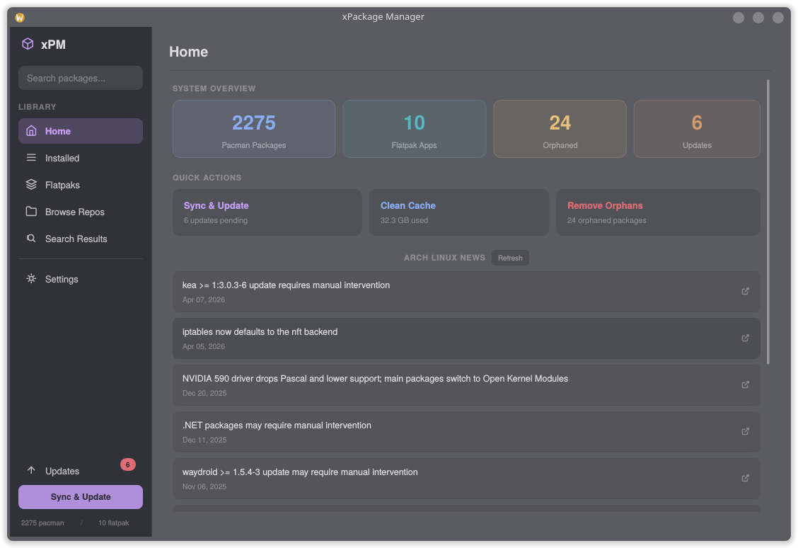

# xPackageManager

A package manager GUI for Arch Linux managing **pacman** and **Flatpak** from one interface. Built with Rust and [Slint](https://slint.dev). 

> No AUR support by design. XeroLinux ships Chaotic-AUR repo with pre-compiled AUR packages.



---

## Features

**Packages**

- Browse, search, and remove installed pacman packages
- Real-time search across sync databases
- Local `.pkg.tar.zst` install via file picker
- Dependency and reverse-dependency tree view
- Browse repos by repository

**Flatpak**

- Full Flathub catalogue browser with category filters
- App detail page: icon, screenshots, description, changelog, links
- Add-ons modal per app (install / remove)
- Installed Flatpaks tab with remove support

**Updates**

- Unified updates list (pacman + Flatpak)
- Separate update actions per backend
- Plasmoid/widget update detection

**System Tray**

- Persistent tray icon after window close
- Scheduled update checks with configurable interval
- Desktop notification with update count and "Update Now" action
- Badge overlay on tray icon showing pending update count
- Autostart support (tray-only daemon mode via `--tray` flag)

**Home Dashboard**

- System stats: CPU, RAM, disk, GPU, kernel, uptime
- Quick-action tiles
- Arch Linux RSS news feed

**Terminal**

- VT100-aware live output with auto-scroll and correct progress bar rendering
- Conflict resolution dialog for pacman file conflicts and dep breaks
- Interactive prompt detection (provider selection, key import)
- SIGTERM cancellation support

**Settings**

Settings are now stored in `~/.config/xpm/config.json` for easy modification.

- Toggle Flatpak support, auto-update checks, parallel downloads, cache retention
- Mirror list update, keyring fix, initramfs rebuild, GRUB rebuild

---

## Architecture

```
xPackageManager/
├── crates/
│   ├── xpm-core/       # Shared types: Package, Operation, PackageSource trait
│   ├── xpm-alpm/       # Pacman backend via libalpm
│   ├── xpm-flatpak/    # Flatpak backend (list, install, remove, updates)
│   ├── xpm-service/    # Orchestration, progress tracking, state management
│   └── xpm-ui/
│       ├── src/main.rs # Rust logic, backend threads, UI message loop
│       └── ui/main.slint
```

---

## Install

**XeroLinux** (recommended):

```bash
sudo pacman -Syy xpm-gui
```

**Other Arch-based distros** :

- Dependencies :

```bash
sudo pacman -S rust cargo flatpak alpm
```

- Without XeroLinux repo :

```bash
git clone https://github.com/xerolinux/xPackageManager
cd xPackageManager && makepkg -rsifcd
```

- With XeroLinux repo :

```bash
echo -e '\n[xerolinux]\nSigLevel = Optional TrustAll\nServer = https://repos.xerolinux.xyz/$repo/$arch' | sudo tee -a /etc/pacman.conf
sudo pacman -Syy xpm-gui
```

---

### To Do

- [ ] Fix Terminal output issues (more robust)

---

## License

GPL-3.0-or-later
